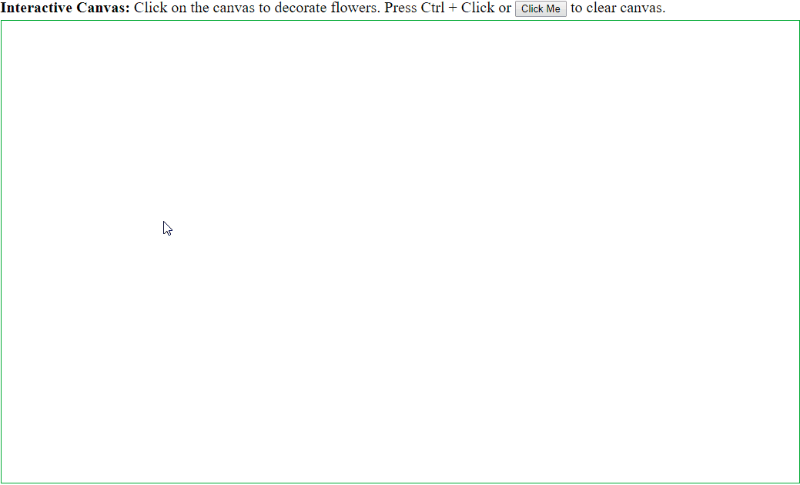
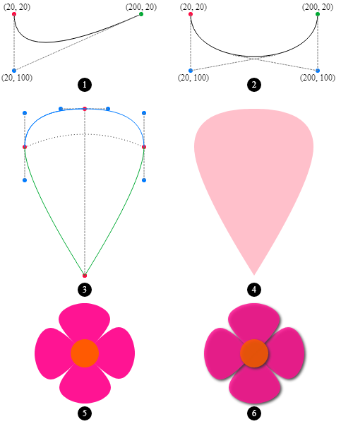

# Canvas Animation in TypeScript

Canvas Animation written in TypeScript. No jQuery and no other 3rd party dependencies. You may also interested in [my another repo about canvas animation](https://github.com/changhuixu/canvas-animation-demos).



## Step-by-step guide can be found in [this Medium Post](https://medium.com/@changhuixu/how-to-compose-canvas-animations-in-typescript-9368dfa29028)

This repo includes blooming flowers animation examples. The flower drawing was inspired and optimized from [this tutorial](https://www.html5canvastutorials.com/advanced/html5-canvas-blooming-flowers-effect/).

## Project Structure

1. **models**

   flower.ts

   flower-center.ts

   petal.ts

   point.ts

1. **services**

   flower-randomization.service.ts

1. **animations**

   blooming-flowers.ts

   interactive-flowers.ts

## Supplementary

In order to show the steps of drawing flower, I also kept the "sandbox" that I played with in `supplementary` folder. The code in `supplementary` folder generates an illustration below.



## How to build locally

```sh
// run the animation app
npm start

// build the app
npm run build
```
